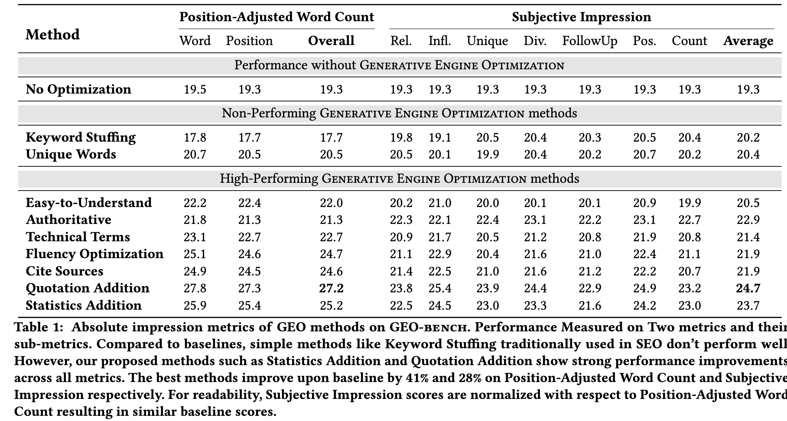

#+title: B2L-December2025
#+options: toc:nil num:nil
* Generative Engine Optimization - Prelim Research
** Existing Products
- https://waikay.io
- https://aiclicks.io
- https://www.babylovegrowth.ai/en
** Reseach Papers
- https://dl.acm.org/doi/pdf/10.1145/3637528.3671900
- https://arxiv.org/pdf/2509.08919  
** High-Performing GEO Methods

Here's how each technique measured up:
- Embedding expert quotes: +41%
- Adding clear statistics: +30%
- Including inline citations: +30%
- Improving readability / fluency: +22%
- Using domain-specific jargon: +21%
- Simplifying language: +15%
- Authoritative voice: +11%
- Using rare synonyms: 0% (Neutral)
- Keyword stuffing: -9% (Negative)
The most successful GEO methods require minimal content changes but significantly improve visibility by enhancing the credibility and richness of the content, achieving relative improvements of 30–40% on the Position-Adjusted Word Count metric and 15–30% on the Subjective Impression metric.
1. Quotation Addition: Adds relevant quotations from credible sources. This was shown to be the best overall single method, improving upon the baseline by up to 41% on the Position-Adjusted Word Count metric. It is particularly effective in domains like ‘People & Society,’ ‘Explanation,’ and ‘History,’ where direct quotes add authenticity and depth.
2. Statistics Addition: Modifies content to include quantitative statistics instead of qualitative discussion, wherever possible. This method showed strong performance improvements across metrics. Data-driven evidence is beneficial in domains like ‘Law & Government’ and for question types like ‘Opinion’.
3. Cite Sources: Adds relevant citations from credible sources. This method is especially beneficial for factual questions, as citations provide a source of verification, enhancing the credibility of the response. It also led to a substantial 115.1% increase in visibility for websites ranked fifth in the Search Engine Results Pages (SERP).
Stylistic and Presentation Methods
These methods primarily enhance the presentation of existing content to increase its persuasiveness or appeal to the generative engine.
4. Fluency Optimization: Improves the fluency of the website text. This resulted in a significant visibility boost of 15–30%, suggesting that GEs value information presentation in addition to content.
5. Easy-to-Understand: Simplifies the language of the website. This also resulted in a significant visibility boost of 15–30%.
6. Authoritative: Modifies the text style of the source content to be more persuasive and authoritative. While overall performance improved with this method, the sources note that GEs are already somewhat robust to this type of stylistic change.
7. Technical Terms: Involves adding technical terms wherever possible.
Methods Requiring Content Addition
Methods like Citation Addition, Quotation Addition, and Statistics Addition may require adding content, while others primarily enhance the presentation of existing material.
Non-Performing Methods
Strategies commonly used in traditional Search Engine Optimization (SEO) were found to be ineffective for GEO:
8. Keyword Stuffing: Modifies content to include more keywords from the query. This offered little to no improvement on generative engine responses, underscoring the need to rethink optimization strategies for GEs.
9. Unique Words: Involves adding unique terms wherever possible. This method did not show strong performance improvements.

* Demo
- https://youtu.be/iVCISHmD3Mg

